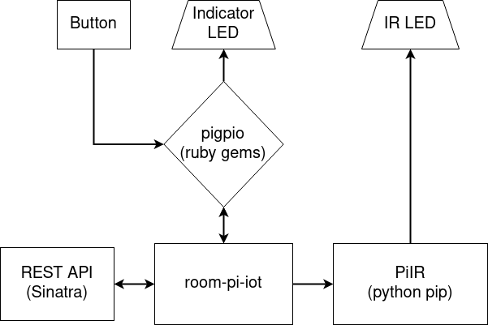

# room-pi-iot
physical and web interface for not-smart device

**This program is a work in progress and the API does not work**  



## Features
* PiIR web API
* toggle button and indicator LED
* post to Influxdb

## Requirements
* Raspberry Pi
* Ruby
* Python
* PiIR waves file `~/PiIR/light.json`
* InfluxDB server (Option)

## Installation

### Clone
```
git clone https://github.com/Coro365/room-pi-iot.git
cd room-pi-iot
bundle install
pip install -r requirements.txt
```

### Edit config.rb
```
vi config/config.rb
```

### Start pigpio daemon.
```
sudo systemctl enable pigpiod
sudo systemctl start pigpiod
```

## Usage
### Web API
#### PUT /api/devises/light
* curl

```
curl -v -H "Accept: application/vnd.piir.v1+json" \
-H "Content-type: application/json" \
-X PUT -d '{"status":"off"}' http://localhost:4567/api/devices/aircon
```
* ruby

```
require 'net/http'
require 'json'

uri = URI.parse('http://localhost:4567/api/devices/aircon')
http = Net::HTTP.new(uri.host, uri.port)
http.use_ssl = uri.scheme == 'https'

headers = { 'Accept' => 'application/vnd.piir.v1+json',
            'Content-Type' => 'application/json' }
params = { status: 'on' }
response = http.put(uri.path, params.to_json, headers)
```

## License
MIT
